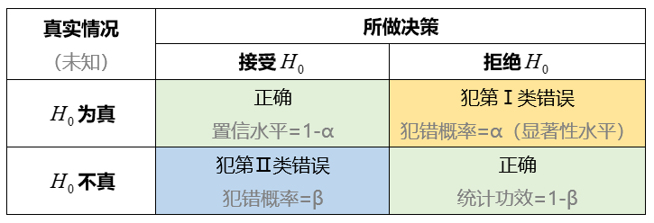
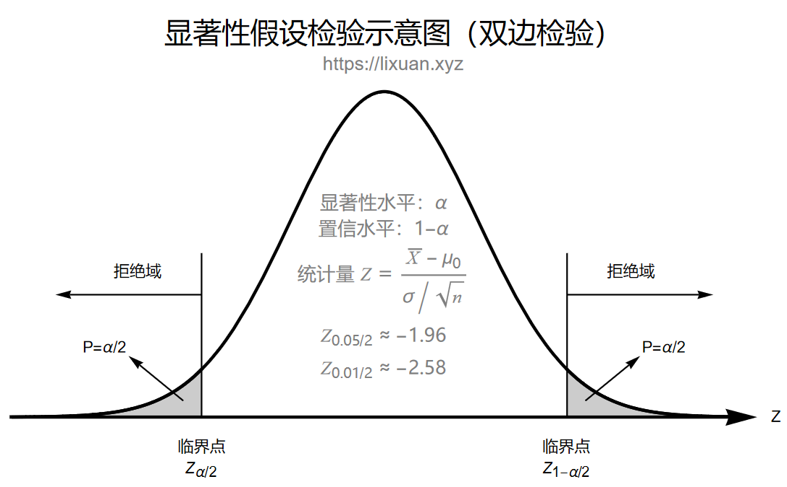

---
pageLayout: doc
title: AB实验常用工具与公式
createTime: 2024-01-07 22:47:00
permalink: /cheat-sheet/math/ab/
---

## 一、常用工具

### 1.1 实验前工具

用于实验前计算所需**最小样本量**的小工具：[G*Power](https://www.psychologie.hhu.de/arbeitsgruppen/allgemeine-psychologie-und-arbeitspsychologie/gpower)。

### 1.2 实验后工具

我还写了 2 个用于实验后计算**显著性、置信区间、效应量、MDE** 的 A/B 实验小工具：
1. Excel 工具：<ActionButton text="AB实验小工具_v1.4.xlsx" color="green" icon="vscode-icons:file-type-excel" url="/downloads/AB实验小工具_v1.4.xlsx" />。
2. Python 工具：安装：`pip install abetter`，说明文档：[ABetter（GitHub）](https://github.com/SqRoots/ABetter)。

## 二、符号说明与相关统计知识

### 2.1 符号说明

#### 2.1.1 统计学中的常用符号

在统计学中，一般使用**大写英文字母**表示随机变量，使用**小写英文字母**表示对总体参数估计的样本统计量，使用**小写希腊字母**表示总体参数：

表 - 统计学中总体与样本的常用符号

| 参数   | 对于总体   | 对于样本       | 对于样本指标的计算公式                                       | 对于样本指标的Hive函数                                    |
| ------ | ---------- | -------------- | ------------------------------------------------------------ | --------------------------------------------------------- |
| 均值   | $\mu$      | $\overline{x}$ | $\overline{x}:=\dfrac{1}{n}\sum\limits_{i=1}^n x_i$          | `avg(nvl(x,0))`，注意是计算**每个样本**的平均值，下同     |
| 比率   | $\pi$      | $p$            | $p:=\dfrac{1}{n}\sum\limits_{i=1}^nx_i,\;x_i\in\{0,1\}$      | `avg(nvl(x,0))`，或者使用计数之比                         |
| 方差   | $\sigma^2$ | $s^2$          | $s^2:=\dfrac{1}{n-1}\sum\limits_{i=1}^n(x_i-\overline{x})^2$ | `var_samp(nvl(x,0))`，而不是总体方差`var_pop`。此外，需要注意的是，在 Hive 中`variance` 是总体方差，在 Spark3 中 `variance` 是样本方差|
| 标准差 | $\sigma$   | $s$            | $s:=\sqrt{s^2}$                                              | `stddev_samp(nvl(x,0))`，而不是总体标准差`stddev_pop`     |

#### 2.1.2 A/B实验中的常用符号

两独立总体均值（或比率）之差的显著性假设检验，通常是将两总体均值（或比率）相等作为原假设：

- 原假设 $H_0$：$|\mu_t-\mu_c|=0$

- 备择假设 $H_1$：$|\mu_t-\mu_c|\ne 0$​

公式中的下脚标 t 为 treat 的首字母，$\mu_t$ 指实验组的总体均值，c 为 control 的首字母，$\mu_c$​​ 指对照组的总体增值。

表 - 假设检验中的两类错误

表 - 假设检验中的两类错误所用符号及解读

| 符号       | 名称                          | 条件                                               |
| ---------- | ----------------------------- | -------------------------------------------------- |
| $\alpha$   | 犯第Ⅰ类错误概率（显著性水平） | 错误地**弃真**：当 $H_0$ 成立时，拒绝 $H_0$ 的概率 |
| $\beta$    | 犯第Ⅱ类错误概率               | 错误地**取伪**：当 $H_1$ 成立时，接受 $H_0$ 的概率 |
| $1-\alpha$ | 置信水平                      | 正确地接受：当 $H_0$ 成立时，接受 $H_0$ 的概率     |
| $1-\beta$  | 统计功效                      | 正确地拒绝：当 $H_1$ 成立时，拒绝 $H_0$ 的概率     |

表 - A/B 实验中常用的符号

| 指标                            | 符号                        |
| ------------------------------- | --------------------------- |
| 样本量（sample size）           | $n$                         |
| 灵敏度（MDE）                   | $\delta$                    |
| p值（p-value）                  | $p$                         |
| 效应量（effect size）           | $d$                         |
| 置信区间（confidence interval） | $(\text{LCI},\,\text{UCI})$ |

### 2.2 统计量

【定义】统计量是样本的函数，并且要求函数中不含任何未知参数。例如，$\overline{x}$，$s$，$\min\{x_i\}，$$\max\{x_i\}$ 都是统计量，而 $\overline{x}/\sigma$ 是否是统计量则取决于 $\sigma$​​ 是否已知。

【作用】通过样本估计总体参数。

【优劣】衡量一个点估计统计量的好坏主要有以下两个方面：

1. 无偏性：统计量的期望等于所要估计的总体参数。例如，$\dfrac{1}{n-1}\sum\limits_{i=1}^n(x_i-\overline{x})^2$ 是 $\sigma^2$ 的无偏估计，但 $\dfrac{1}{n}\sum\limits_{i=1}^n(x_i-\overline{x})^2$ 不是。

2. 有效性：统计量的方差越小越有效。例如当样本独立且样本量大于1时，$x_1$ 和 $\overline{x}$ 都是 $\mu$ 的无偏估计，但 $\mathrm{Var}(x_1)=\sigma^2>\mathrm{Var}(\overline{x})=\sigma^2/n$，所以后者更有效。

【UMVUE】一致最小方差无偏估计：一个参数的无偏估计有无穷多个，其中方差最小的那个就是 UMVUE。

### 2.3 中心极限定理

#### 2.3.1 独立同分布下的中心极限定理

**林德伯格-莱维**（Lindeberg-Lévy）**中心极限定理**：设 $\{X_n\}$ 是独立同分布的随机变量序列，且 $\mathrm{E}(X_i)=\mu$，$\mathrm{Var}(X_i)=\sigma$ 存在，记

$$
Y_n=\dfrac{X_1+X_2+\cdots+X_n-n\mu}{\sigma\sqrt{n}}=\dfrac{\overline{x}-\mu}{\sqrt{\sigma^2/n}}.
$$

则对任意实数 $y$，有

$$
\lim_{n\rightarrow\infty}\mathrm{P}(Y_n\leqslant y)=\Phi(y)=\dfrac{1}{\sqrt{2n}}\int_{-\infty}^y \mathrm{e}^{-\frac{t^2}{2}}\mathrm{d}t.
$$

从形式上，可记为：

$$
\dfrac{\overline{x}-\mu}{\sqrt{\sigma^2/n}}=\dfrac{\overline{x}-\mu}{\sigma_{\overline{x}}}={\color{blue}\dfrac{样本均值-总体均值}{标准误}\sim \text{标准正态分布} N(0,1)}
$$

**标准误**是指统计量的标准差，例如样本均值 $\overline{x}$ 的标准误为：

$$
\sigma_{\overline{x}}=\sqrt{\mathrm{Var}(\overline{x})}=\sqrt{\dfrac{\sum\limits_{i=1}^n \mathrm{Var}(x_i)}{n^2}}=\sqrt{\dfrac{n\sigma^2}{n^2}}=\dfrac{\sigma}{\sqrt{n}}
$$

可见，当总体方差存在时，**样本量越大，样本均值的标准误就越小**。

#### 2.3.2 独立不同分布下的中心极限定理

更一般的，不要求同分布，只要在和的各项中没有起到突出作用的项，或者说，各项在概率意义下“均匀地小”，那么标准化后的随机变量之和就服从正态分布。

设 $n$ 个相互独立的随机变量 $X_i$（并不要求它们同分布），它们期望 $\mu_i$ 和方差 $\sigma_i$ **存在**且**有限**，设它们的和为 $Y_n=\sum\limits_{i=1}^n X_i$，则有：

$$
\mathrm{E}(Y_n)=\mu_1+\mu_2+\cdots+\mu_n
$$

$$
\mathrm{Var}(Y_n)=\sigma_1^2+\sigma_2^2+\cdots+\sigma_n^2
$$

记 $B_n=\sqrt{\mathrm{Var}(Y_n)}=\sqrt{\sigma_1^2+\sigma_2^2+\cdots+\sigma_n^2}$，则 $Y_n$ 的标准化为：

$$
Y_n^*=\dfrac{Y_n-\mathrm{E}(Y_n)}{B_n}=\sum\limits_{i=1}^n\dfrac{(X_i-\mu_i)}{B_n}
$$

**林德伯格条件**：如果对 $\forall \tau>0$ 都有 $\lim\limits_{n\rightarrow \infty}\mathrm{P}(\max\limits_{1\leqslant i\leqslant n}|X_i-\mu_i|>\tau B_n)=0$。林德伯格条件保证了 $Y_n^*$ 中的各项 $(X_i-\mu_i)/B_n$ “均匀地小”。

**林德伯格中心极限定理**：设独立随机变量序列 $\{X_n\}$ 满足林德伯格条件，则对任意实数 $y$，有

$$
\lim\limits_{n\rightarrow \infty}\mathrm{P}\left(Y_n^*\leqslant y\right)=\Phi(y)=\dfrac{1}{\sqrt{2n}}\int_{-\infty}^y \mathrm{e}^{-\frac{t^2}{2}}\mathrm{d}t.
$$

**李雅普诺夫中心极限定理**：设独立随机变量序列 $\{X_n\}$，若存在 $\delta>0$，满足

$$
\lim\limits_{n\rightarrow\infty}\dfrac{1}{B_n^{2+\delta}}\sum\limits_{i=1}^n\mathrm{E}(|X_i-\mu_i|^{2+\delta})=0
$$

则对任意实数 $y$，有

$$
\lim\limits_{n\rightarrow \infty}\mathrm{P}\left(Y_n^*\leqslant y\right)=\Phi(y)=\dfrac{1}{\sqrt{2n}}\int_{-\infty}^y \mathrm{e}^{-\frac{t^2}{2}}\mathrm{d}t.
$$

#### 2.3.3 二项分布的正态近似

**棣莫弗-拉普拉斯**（de Moiver-Laplace）**中心极限定理**：设 $n$ 重伯努利试验中，事件 A 在每次试验中出现的概率为 $0<p<1$，$q=1-p$，记 $S_n$ 为 $n$ 次试验中事件 A 出现的次数，记

$$
Y_n=\dfrac{S_n-np}{\sqrt{npq}}.
$$

则对任意实数 $y$，有

$$
\lim_{n\rightarrow\infty}\mathrm{P}(Y_n\leqslant y)=\Phi(y)=\dfrac{1}{\sqrt{2n}}\int_{-\infty}^y \mathrm{e}^{-\frac{t^2}{2}}\mathrm{d}t.
$$

## 三、常用公式

### 3.1 统计量

#### 3.1.1 两独立总体均值之差的统计量

按方差是否已知和是否相等，两独立总体均值之差的统计量公式共有以下 6 种形式（其中 $\sigma^2$ 为总体方差，$s^2$​ 为样本方差）：

表 - 统计量（均值之差）

|                                                              | 大样本（$n_t\geqslant30\;\text{and}\;n_c\geqslant30$）       | 小样本（$2\leqslant n_t<30\;\text{or}\;2\leqslant n_c<30$）  |
| ------------------------------------------------------------ | ------------------------------------------------------------ | ------------------------------------------------------------ |
| 使用条件                                                     | 1）两总体独立                                                | 1）两总体独立 2）两总体服从正态分布                     |
| 方差$\sigma_t^2$和$\sigma_c^2$已知                           | $z=\dfrac{(\overline{x}_t-\overline{x}_c)-(\mu_t-\mu_c)}{\sqrt{\dfrac{\sigma_t^2}{n_t}+\dfrac{\sigma_c^2}{n_c}}}\sim N(0,1)$ | 同左                                                         |
| 方差$\sigma_t^2$和$\sigma_c^2$未知，且$\sigma_t^2=\sigma_c^2$ | $z=\dfrac{(\overline{x}_t-\overline{x}_c)-(\mu_t-\mu_c)}{\sqrt{\dfrac{s_t^2}{n_t}+\dfrac{s_c^2}{n_c}}}\sim N(0,1)$ | $t=\dfrac{(\overline{x}_t-\overline{x}_c)-(\mu_t-\mu_c)}{s_w\sqrt{\dfrac{1}{n_t}+\dfrac{1}{n_c}}}\sim t(n_t+n_c-2)$ 其中合并方差（方差的加权平均值）为$s_w^2=\dfrac{(n_t-1)s_t^2+(n_c-1)s_c^2}{n_t+n_c-2}$ |
| 方差$\sigma_t^2$和$\sigma_c^2$未知，且$\sigma_t^2\ne\sigma_c^2$ | 同上                                                         | $t=\dfrac{(\overline{x}_t-\overline{x}_c)-(\mu_t-\mu_c)}{\sqrt{\dfrac{s_t^2}{n_t}+\dfrac{s_c^2}{n_c}}}\sim t(v)$ 其中t分布的自由度$v=\dfrac{(s_t^2/n_t+s_c^2/n_c)^2}{\dfrac{(s_t^2/n_t)^2}{n_t-1}+\dfrac{(s_c^2/n_c)^2}{n_c-1}}$ |

#### 3.1.2 两独立总体比率之差的统计量

两个独立总体的阳性比率分别为 $\pi_t,\;\pi_c$，样本量分别为 $n_t,\;n_c$，阳性样本量分别为 $x_t,\;x_c$，则样本阳性比率为 $p_t=x_t/n_t,\;p_c=x_c/n_c$​。

表 - 统计量（比率之差）

|                            | 大样本                                                       |
| -------------------------- | ------------------------------------------------------------ |
| 使用条件                   | 1）两总体独立 2）每组每类样本量都大于等于10（$x_t\geqslant10,x_c\geqslant10,(n_t-x_t)\geqslant10,(n_c-x_c)\geqslant10$） |
| $H_0:\;\pi_t-\pi_c=0$      | $z=\dfrac{p_t-p_c}{\sqrt{p(1-p)\left(\dfrac{1}{n_t}+\dfrac{1}{n_c}\right)}}\sim N(0,1)$ 其中$p=\dfrac{x_t+x_c}{n_t+n_c}=\dfrac{p_t n_t+p_c n_c}{n_t+n_c}$，$x_1,x_2$ 分别是两样本中的阳性样本量。 |
| $H_0:\;\pi_t-\pi_c=\delta$ | $z=\dfrac{(p_t-p_c)-\delta}{\sqrt{\dfrac{p_t(1-p_t)}{n_t}+\dfrac{p_c(1-p_c)}{n_c}}}\sim N(0,1)$ |

### 3.2 置信区间

什么是置信区间：总体参数 $\theta$ 的置信水平为 $1-\alpha$ 的置信区间 $(LCI, UCI)$ ，其能以概率  $1-\alpha$ 覆盖到真实的 $\theta$。

#### 3.2.1 两独立总体均值之差的置信区间

表 - 置信区间计算公式（均值之差）

| 条件                                                         | 大样本                                                       | 小样本                                                       |
| ------------------------------------------------------------ | ------------------------------------------------------------ | ------------------------------------------------------------ |
| 使用条件                                                     | 1）两总体独立                                                | 1）两总体独立 2）两总体服从正态分布                     |
| 方差$\sigma_t^2$和$\sigma_c^2$已知                           | $(\overline{x}_t-\overline{x}_c)\pm z_{\alpha/2}\sqrt{\dfrac{\sigma_t^2}{n_t}+\dfrac{\sigma_c^2}{n_c}})$ | 同左                                                         |
| 方差$\sigma_t^2$和$\sigma_c^2$未知，且$\sigma_t^2=\sigma_c^2$ | $(\overline{x}_t-\overline{x}_c)\pm z_{\alpha/2}\sqrt{\dfrac{s_t^2}{n_t}+\dfrac{s_c^2}{n_c}}$ | $(\overline{x}_t-\overline{x}_c)\pm t_{\alpha/2}(v)s_w\sqrt{\dfrac{1}{n_t}+\dfrac{1}{n_c}}$ 其中t分布的自由度$v=n_t+n_c-2$ 其中方差的加权平均值为$s_w^2=\dfrac{(n_t-1)s_t^2+(n_c-1)s_c^2}{n_t+n_c-2}$ |
| 方差$\sigma_t^2$和$\sigma_c^2$未知，且$\sigma_t^2\ne\sigma_c^2$ | 同上                                                         | $(\overline{x}_t-\overline{x}_c)\pm t_{\alpha/2}(v)\sqrt{\dfrac{s_t^2}{n_t}+\dfrac{s_c^2}{n_c}}$ 其中t分布的自由度为$v=\dfrac{(s_t^2/n_t+s_c^2/n_c)^2}{\dfrac{(s_t^2/n_t)^2}{n_t-1}+\dfrac{(s_c^2/n_c)^2}{n_c-1}}$ |

#### 3.2.2 两独立总体比率之差的置信区间

表 - 置信区间计算公式（比率之差）

| 大样本                                                       | 任意大小样本                                                 |
| ------------------------------------------------------------ | ------------------------------------------------------------ |
| $(p_t-p_c)\pm z_{\alpha/2}\sqrt{\dfrac{p_t(1-p_t)}{n_t}+\dfrac{p_c(1-p_c)}{n_c}}$ | $(\widetilde{p}_t-\widetilde{p}_t)\pm z_{\alpha/2}\sqrt{\dfrac{\widetilde{p}_t(1-\widetilde{p}_t)}{\widetilde{n}_t}+\dfrac{\widetilde{p}_c(1-\widetilde{p}_c)}{\widetilde{n}_c}}$ 其中 $\widetilde{n}_t=n_t+2,\;\widetilde{n}_c=n_c+2,\;\widetilde{p}_t=\dfrac{x_t+1}{n_t+2},\;\widetilde{p}_c=\dfrac{x_c+1}{n_c+2}$。 该区间被称为 Agresti-Coull 区间，当其小于0或大于1时，修正为0或1。 |

### 3.3 显著性（p 值）

按不同需求，检验可分为**单尾检验**（$H_0:一个均值大于另一个均值$）和**双尾检验**（$H_0:两总体均值相等$）两种。常用的显著性水平有 **0.05** 和 **0.01**。

首先根据原假设 $H_0$ 确实是单尾还是双尾检验，然后在 3.1 节选择对应的统计量，代入样本计算出统计量的观测值，再参考下图即可得到 p 值。

### 3.4 效应量

当假设检验拒绝原假设时，表示参数与假设值之间差异显著，但这一结果并未告诉我们差异的大小（程度）。度量差异大小的统计量就是**效应量**（Effect Size），**如果假设检验拒绝了原假设，一般应该给出相应的效应量**。效应量描述 了结果的差异程度，Cohen 用以下公式计算效应量，记为 Cohen's d：

$$
{\color{blue}\text{Cohen's}\;d=\dfrac{|\text{样本均值之差}-\text{假设均值之差}|}{\text{合并样本标准差}}}
$$

其含意是参数与假设值之间相差几个样本标准差，例如当效应量为 0.90 时，表示样本均值与假设的总体均值相差 0.90 个标准差。

根据 Cohen（1988）提出的标准，独立样本t检验的小、中、大效应量对应的d值分别为 0.20，0.50，0.80：

- 当 $d<0.20$ 时，为非常小的效应量；

- 当 $0.20\leqslant d<0.5$ 时，为小的效应量；

- 当 $0.5\leqslant d<0.8$ 时，为中等效应量；

- 当 $d\geqslant0.8$​​ 时，为大的效应量。

表 - 常见检验方法的效应量计算公式

| 检验方法                                 | Cohen's d                                                    |
| ---------------------------------------- | ------------------------------------------------------------ |
| 均值指标：Z 检验（方差未知）             | $\dfrac{\lvert(\overline{x}_t-\overline{x}_c)-(\mu_t-\mu_c)\rvert}{s_w}$ |
| 均值指标：t 检验（方差未知，且方差相同） | $\lvert t\rvert\sqrt{\dfrac{n_t+n_c}{n_t n_c}}$              |
| 比率指标：Z 检验                         | $\dfrac{\lvert(p_t-p_c)-(\pi_t-\pi_c)\rvert}{\sqrt{p(1-p)}}{\color{gray},\;\text{其中} p=\dfrac{x_t+x_c}{n_t+n_c}=\dfrac{p_t n_t+p_c n_c}{n_t+n_c}}$ |

### 3.5 灵敏度

**MDE**（Minimum Detectable Effect，最小检测效应）是用于衡量检验灵敏度的指标，相当于显微镜的分辨率，MDE 的值越小检验的灵敏度越高。例如，当两个总体均值之差为 0.25 时，使用 MDE = 5.20 的实验检验出的结果是不可靠，就好比是使用光学显微镜测量出了原子的直径。

MDE 的大小受以下5个因素影响：检验方法、犯第Ⅰ类错误概率 α（↓）、犯第Ⅱ类错误 β（↓）、方差（↑）、样本量（↓），括号中的箭头表示该指标对 MDE 的影响方向。

Z检验的 MDE 公式在形式上可记为：

$$
MDE={\color{blue}(z_{\alpha/2}+z_{\beta})\times\text{标准误}}
$$

备注：一般取 $\alpha=0.05,\;\beta=0.20$，此时 $z_{\alpha/2}+z_\beta=$​ 2.8015852，更多置信水平和功效水平的上分位数参见附录。

表 - MDE 计算公式

| 检验方法                                 | 双尾 MDE                                                     |
| ---------------------------------------- | ------------------------------------------------------------ |
| 均值指标：Z 检验（方差未知）             | $(z_{\alpha/2}+z_{\beta})\sqrt{\dfrac{s_t^2}{n_t}+\dfrac{s_c^2}{n_c}}$ |
| 均值指标：t 检验（方差未知，且方差相同） | $[t_{\alpha/2}(n_t+n_c-2)+t_{\beta}(n_t+n_c-2)]s_w\sqrt{\dfrac{1}{n_t}+\dfrac{1}{n_c}}$ |
| 均值指标：t 检验（方差未知，且方差不同） | $[t_{\alpha/2}(v)+t_{\beta}(v)]\sqrt{\dfrac{s_t^2}{n_t}+\dfrac{s_c^2}{n_c}}$ |
| 比率指标：Z 检验                         | $(z_{\alpha/2}+z_{\beta})\sqrt{p(1-p)\left(\dfrac{1}{n_t}+\dfrac{1}{n_c}\right)},\;{\color{gray}\text{其中} p=\dfrac{x_t+x_c}{n_t+n_c}=\dfrac{p_t n_t+p_c n_c}{n_t+n_c}}$ |

### 3.6 样本量

虽然样本量越大 MDE 越高（值越小），但实验成本也越高。为平衡两者，在实验前需要先根据具体情况和需求（检验对象的方差、可接受的最大犯错概率）确定 MDE，然后根据 MDE 公式即可反推出实验所需要的最小样本量。

推荐使用免费工具 [G*Power](https://www.psychologie.hhu.de/arbeitsgruppen/allgemeine-psychologie-und-arbeitspsychologie/gpower) 来计算样本量。

| 验方法                                   | 最小样本量                                                   | 备注                                                         |
| ---------------------------------------- | ------------------------------------------------------------ | ------------------------------------------------------------ |
| 均值指标：Z 检验（方差未知）             | $n_t=\dfrac{(z_{\alpha/2}+z_{\beta})^2}{\delta^2}(s_t^2+r\times s_c^2)$ $n_c=\dfrac{n_t}{r}$ | $\delta=\mu_t-\mu_c$                                         |
| 均值指标：t 检验（方差未知，且方差相同） | [待补充] | [待补充] |
| 均值指标：t 检验（方差未知，且方差不同） | [待补充] | [待补充] |
| 比率指标：Z 检验                         | $n_t=\dfrac{(z_{\alpha/2}+z_{\beta})^2}{\delta^2}[p_t(1-p_t)+r\times p_c(1-p_c)]$ $n_c=\dfrac{n_t}{r}$ | $\delta=\pi_t-\pi_c$                                         |

## 四、FAQ

[不同结果的解读]

[不同样本量的二项分布与正态分布的误差]

[不同样本量的样本均值分布与正态分布的误差]

## 附录

表 - 常用正态分布上分位数

| α    | β    | $z_{\alpha/2}$ | $z_\beta$     | $z_{\alpha/2}+z_\beta$ |
| ---- | ---- | -------------- | ------------- | ---------------------- |
| 0.05 | 0.20 | 1.95996398454  | 0.84162123357 | 2.80158521811          |
| 0.05 | 0.10 | 1.95996398454  | 1.28155156555 | 3.24151555009          |
| 0.05 | 0.05 | 1.95996398454  | 1.64485362695 | 3.60481761149          |
| 0.05 | 0.01 | 1.95996398454  | 2.32634787404 | 4.28631185858          |
| 0.01 | 0.20 | 2.57582930355  | 0.84162123357 | 3.41745053712          |
| 0.01 | 0.10 | 2.57582930355  | 1.28155156555 | 3.85738086909          |
| 0.01 | 0.05 | 2.57582930355  | 1.64485362695 | 4.22068293050          |
| 0.01 | 0.01 | 2.57582930355  | 2.32634787404 | 4.90217717759          |

## 参考资料

- **贾俊平《统计学基于R》第5版**，中国人民大学出版社，2023：勘误：P173-175，公式7.6、公式7.7、公式7.9、公式7.10分母中的减号均应为加号，公式7.8分母中的$n_1+n_2-1$ 应为 $n_1+n_2-2$；

- Georgi Z. Georgiev. **Statistical Methods in Online A/B Testing: Statistics for data-driven business decisions and risk management in e-commerce**, 2019.

- 茆诗松《概率论与数理统计》第3版，高等教育出版社，2019；

- 贾俊平《统计学》第8版，中国人民大学出版社，2021；

- 刘启林. [A/B测试(AB实验)的基础、原理、公式推导、Python实现和应用](https://zhuanlan.zhihu.com/p/346602966)；

- **Bloom, H.S, MINIMUM DETECTABLE EFFECTS: A Simple Way to Report the Statistical Power of Experimental Designs, 1995**；

- 盛骤《概率论与数理统计》第4版，高等教育出版社，2008。

