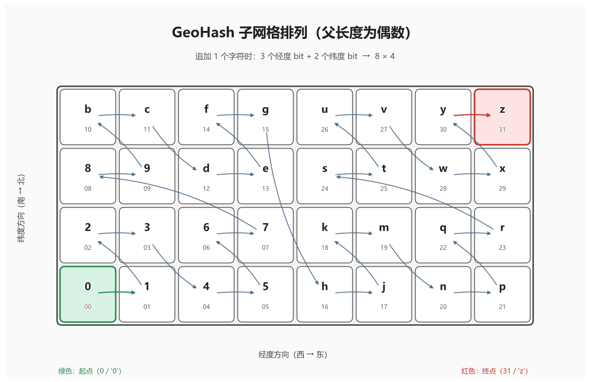
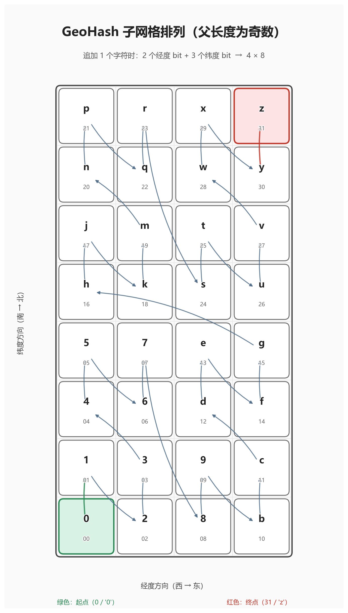

## 1️⃣ 简介

GeoHash 把一个地理坐标 `(纬度, 经度)` 编码成一个短字符串，而且这个字符串的**前缀带有空间层级含义**。

**它把经纬度这种二维空间问题，转换成“可排序、可前缀搜索”的一维字符串/整数问题。**它特别适合做**地理数据粗索引、附近搜索预筛、空间聚合**；它最重要的性质是**前缀层级性**和**局部相近性**；它最大的缺点是**边界效应**和**网格并不等面积/不适合直接做精确距离判断**。

## 2️⃣ 有什么用

GeoHash 主要解决的是：**经纬度是二维数据，不方便直接用普通字符串前缀或一维有序索引高效检索“附近的位置”**。GeoHash 把二维坐标变成一个**可排序、可按前缀搜索**的字符串或整数，这样数据库就能复用普通索引结构做一部分地理检索。

所以它特别适合做这几类事情：

1. **附近搜索的粗筛**：先找同 GeoHash 前缀或相邻格子的点，再做精确距离计算。([Movable Type](https://www.movable-type.co.uk/scripts/geohash.html?utm_source=chatgpt.com))
2. **空间聚合 / 热力图**：把点按不同精度的网格桶分组。Elastic 和 OpenSearch 都直接支持 geohash grid aggregation。([Elastic](https://www.elastic.co/docs/reference/aggregations/search-aggregations-bucket-geohashgrid-aggregation?utm_source=chatgpt.com))
3. **分片、缓存、范围裁剪**：比如按前缀把附近数据落到同一批 key 或分区里。这个是它在工程上很常见的价值。由其“前缀可搜索”和“精度可调”这两个性质推得出来。([PostGIS](https://postgis.net/docs/ST_GeoHash.html?utm_source=chatgpt.com))

## 3️⃣ 规律和性质

### ❶ 前缀层级性

GeoHash 最重要的性质就是：**去掉后缀，区域会变大，并且包含原区域；延长后缀，区域会变小，是原区域的子区域。**
也就是说：

- `wx4g0` 表示一个较小格子
- `wx4g` 表示它的父格子
- `wx4` 表示更大的父格子

### ❷ 公共前缀越长通常越近

如果两个点的 GeoHash 有相同的前缀，并且相同前缀越长，它们在空间上的距离一般越近。

但反过来**不成立**：两个点很近，GeoHash 也可能前缀完全不像，尤其当它们刚好落在网格边界两侧时。

### ❸ 字符越长精度越高

因为 1 个字符 = 5 bit，所以每多 1 个字符，就相当于把网格继续细分了 32 块，面积缩小 1/32。每多 2 个字符，网格边长缩短 1/32。

- 长度 1：约 **5009 km × 4993 km**
- 长度 2：约 **1252 km × 624 km**
- 长度 3：约 **156.5 km × 156 km**
- 长度 4：约 **39.1 km × 19.5 km**
- 长度 5：约 **4.9 km × 4.9 km**
- 长度 6：约 **1.2 km × 609 m**
- 长度 7：约 **153 m × 152 m**
- 长度 8：约 **38.2 m × 19 m** ([Elastic](https://www.elastic.co/docs/reference/aggregations/search-aggregations-bucket-geohashgrid-aggregation?utm_source=chatgpt.com))

### ❹ 奇偶长度规律

这是 GeoHash 很有意思的一个规律：

- **奇数长度**时，经度位数比纬度位数多 1 位
- **偶数长度**时，经纬度位数相同。

因此在赤道附近，GeoHash 的格子会呈现一种交替模式：

- **奇数位长度**：宽高大致接近正方形
- **偶数位长度**：宽度大约是高度的 2 倍。

GeoHash的父长度是**偶数**时，32个子块排列成**横向**的长方形（4行8列）：
{width=500 style="margin: 0 auto; display: flex; border-radius:8px;"}

GeoHash的父长度是**奇数**时，32个子块排列成**纵向**的长方形（8行4列）：
{width=500 style="margin: 0 auto; display: flex; border-radius:8px;"}


```python title="绘图代码（由AI生成）" :collapsed-lines=1
import matplotlib.pyplot as plt
import matplotlib.patheffects as pe
from matplotlib.patches import FancyBboxPatch, FancyArrowPatch
from matplotlib import font_manager, rcParams

# GeoHash Base32 alphabet
BASE32 = "0123456789bcdefghjkmnpqrstuvwxyz"


def setup_chinese_font():
    """
    自动寻找系统中可用的中文字体，解决 matplotlib 中文乱码问题。
    """
    candidate_fonts = [
        "Microsoft YaHei",       # Windows
        "SimHei",                # Windows 常见黑体
        "SimSun",                # Windows 宋体
        "PingFang SC",           # macOS
        "Heiti SC",              # macOS
        "STHeiti",               # macOS
        "Noto Sans CJK SC",      # Linux / macOS / 部分环境
        "Source Han Sans SC",    # 思源黑体
        "WenQuanYi Zen Hei",     # Linux
        "Arial Unicode MS"       # 某些环境可用
    ]

    available_fonts = {f.name for f in font_manager.fontManager.ttflist}

    for font_name in candidate_fonts:
        if font_name in available_fonts:
            rcParams["font.sans-serif"] = [font_name]
            rcParams["axes.unicode_minus"] = False
            print(f"使用中文字体: {font_name}")
            return font_name

    # 如果一个都没找到，给出提示
    rcParams["axes.unicode_minus"] = False
    print("未找到可用中文字体，中文可能仍会乱码。")
    print("你可以手动安装如 Noto Sans CJK SC / Microsoft YaHei / SimHei 等字体。")
    return None


def child_grid_shape(parent_length_parity: str):
    """
    parent_length_parity:
        - 'even': 父 GeoHash 长度为偶数，追加 1 个字符时：
                  bit 顺序为 lon, lat, lon, lat, lon -> 8 x 4
        - 'odd' : 父 GeoHash 长度为奇数，追加 1 个字符时：
                  bit 顺序为 lat, lon, lat, lon, lat -> 4 x 8
    """
    if parent_length_parity == "even":
        return 8, 4
    elif parent_length_parity == "odd":
        return 4, 8
    else:
        raise ValueError("parent_length_parity must be 'even' or 'odd'")


def char_position(index: int, parent_length_parity: str):
    """
    根据 Base32 下标（0~31），计算它在子网格中的位置。
    返回 (x, y)，其中：
      - x: 经度方向（西 -> 东）
      - y: 纬度方向（南 -> 北）
    """
    bits = f"{index:05b}"

    if parent_length_parity == "even":
        # 追加字符时 bit 顺序: lon, lat, lon, lat, lon
        x_bits = bits[0] + bits[2] + bits[4]  # 3 bits -> 8 columns
        y_bits = bits[1] + bits[3]            # 2 bits -> 4 rows
    else:
        # 追加字符时 bit 顺序: lat, lon, lat, lon, lat
        x_bits = bits[1] + bits[3]            # 2 bits -> 4 columns
        y_bits = bits[0] + bits[2] + bits[4]  # 3 bits -> 8 rows

    return int(x_bits, 2), int(y_bits, 2)


def arrow_curve(p1, p2):
    """
    根据相邻格子的相对位置，给箭头一个轻微弧度，提升可读性。
    """
    x1, y1 = p1
    x2, y2 = p2
    dx = x2 - x1
    dy = y2 - y1

    if dx == 0 or dy == 0:
        rad = 0.08
    else:
        rad = 0.14

    sign = 1 if (int(x1 + y1 + x2 + y2) % 2 == 0) else -1
    return f"arc3,rad={sign * rad}"


def draw_layout(parent_length_parity: str, save_path: str):
    cols, rows = child_grid_shape(parent_length_parity)

    fig_w = cols * 1.45 + 2
    fig_h = rows * 1.45 + 2
    fig, ax = plt.subplots(figsize=(fig_w, fig_h), dpi=180)

    ax.set_xlim(-0.9, cols + 0.9)
    ax.set_ylim(-0.9, rows + 1.4)
    ax.set_aspect("equal")
    ax.set_facecolor("#fafafa")
    fig.patch.set_facecolor("white")

    # 网格底线
    for x in range(cols + 1):
        ax.plot([x, x], [0, rows], color="#e9e9e9", lw=1, zorder=0)
    for y in range(rows + 1):
        ax.plot([0, cols], [y, y], color="#e9e9e9", lw=1, zorder=0)

    # 外边框
    border = FancyBboxPatch(
        (0, 0), cols, rows,
        boxstyle="round,pad=0.02,rounding_size=0.08",
        linewidth=2.0, edgecolor="#444444", facecolor="none", zorder=1
    )
    ax.add_patch(border)

    # 标题与说明
    if parent_length_parity == "even":
        title = "GeoHash 子网格排列（父长度为偶数）"
        subtitle = "追加 1 个字符时：3 个经度 bit + 2 个纬度 bit  →  8 × 4"
    else:
        title = "GeoHash 子网格排列（父长度为奇数）"
        subtitle = "追加 1 个字符时：2 个经度 bit + 3 个纬度 bit  →  4 × 8"

    ax.text(
        cols / 2, rows + 0.92, title,
        ha="center", va="center", fontsize=20, fontweight="bold", color="#222222"
    )
    ax.text(
        cols / 2, rows + 0.52, subtitle,
        ha="center", va="center", fontsize=11.5, color="#555555"
    )

    # 坐标方向标签
    ax.text(cols / 2, -0.52, "经度方向（西 → 东）", ha="center", va="center",
            fontsize=11, color="#444444")
    ax.text(-0.62, rows / 2, "纬度方向（南 → 北）", ha="center", va="center",
            rotation=90, fontsize=11, color="#444444")

    centers = []

    # 颜色
    normal_face = "#ffffff"
    normal_edge = "#6e6e6e"
    start_face = "#d9f2e6"
    start_edge = "#2e8b57"
    end_face = "#fde3e3"
    end_edge = "#c0392b"

    # 绘制 32 个子网格
    for i, ch in enumerate(BASE32):
        x, y = char_position(i, parent_length_parity)

        face = normal_face
        edge = normal_edge
        lw = 1.4

        if i == 0:
            face = start_face
            edge = start_edge
            lw = 2.2
        elif i == 31:
            face = end_face
            edge = end_edge
            lw = 2.2

        cell = FancyBboxPatch(
            (x + 0.05, y + 0.05), 0.90, 0.90,
            boxstyle="round,pad=0.02,rounding_size=0.08",
            linewidth=lw, edgecolor=edge, facecolor=face, zorder=2
        )
        ax.add_patch(cell)

        # 大字：Base32 字符
        t1 = ax.text(
            x + 0.5, y + 0.62, ch,
            ha="center", va="center",
            fontsize=15, fontweight="bold", color="#222222", zorder=4
        )
        t1.set_path_effects([pe.withStroke(linewidth=2, foreground="white")])

        # 小字：顺序编号
        t2 = ax.text(
            x + 0.5, y + 0.28, f"{i:02d}",
            ha="center", va="center",
            fontsize=8.8, color="#666666", zorder=4
        )
        t2.set_path_effects([pe.withStroke(linewidth=2, foreground="white")])

        centers.append((x + 0.5, y + 0.5))

    # 顺序连接线（带箭头）
    for i in range(len(centers) - 1):
        p1 = centers[i]
        p2 = centers[i + 1]

        if i == 0:
            color = "#2e8b57"
            lw = 2.0
        elif i == len(centers) - 2:
            color = "#c0392b"
            lw = 2.0
        else:
            color = "#4f6d8a"
            lw = 1.4

        arrow = FancyArrowPatch(
            p1, p2,
            arrowstyle="-|>",
            mutation_scale=10,
            linewidth=lw,
            color=color,
            alpha=0.85,
            shrinkA=16,
            shrinkB=16,
            connectionstyle=arrow_curve(p1, p2),
            zorder=3
        )
        ax.add_patch(arrow)

    ax.text(
        0.0, -0.80,
        "绿色：起点（0 / '0'）",
        ha="left", va="center", fontsize=10, color="#2e8b57"
    )
    ax.text(
        cols, -0.80,
        "红色：终点（31 / 'z'）",
        ha="right", va="center", fontsize=10, color="#c0392b"
    )

    ax.set_xticks([])
    ax.set_yticks([])
    for spine in ax.spines.values():
        spine.set_visible(False)

    plt.tight_layout()
    plt.savefig(save_path, bbox_inches="tight", facecolor="white")
    plt.close(fig)


if __name__ == "__main__":
    setup_chinese_font()   # 关键：先设置中文字体
    draw_layout("even", "geohash_layout_even.png")
    draw_layout("odd", "geohash_layout_odd.png")
```

## 4️⃣ 局限性

### ❶ 边界问题

这是 GeoHash 最经典的问题。两个点虽然物理上很近，但如果跨过这些边界，前缀可能完全不相似：

- 国际日期变更线（±180°）
- 赤道
- 本初子午线
- 极地区域。

所以做附近搜索时，不能只搜“同一个前缀”，通常还要将其周边的 **8 个邻居格子**一起搜（“井”字九宫格），再做一次精确距离过滤。

### ❷ 不等面积，也不等形

GeoHash 划分出来的是经纬度矩形，不是球面上的等面积单元。也就是说，越靠近高纬，东西向实际距离会越小。

### ❸ 不能直接“精确半径查询”

GeoHash 天然对应的是**矩形格子**，不是圆。所以“查 1km 内所有点”通常是：

1. 选一个合适精度的 GeoHash。
2. 查当前格子 + 邻居格子。
3. 再用 Haversine 等精确距离公式过滤。


## 5️⃣ 它是怎么编码的

### ❶ 框架

GeoHash 的经典字符串使用一种特殊的 **Base32** 字母表：`0123456789bcdefghjkmnpqrstuvwxyz`，故意去掉了 `a i l o`，因为这些字符容易和数字混淆。每个字符代表 **5 个二进制位**。

| 数字 | Base 32 |      | 数字 | Base 32 |      | 数字 | Base 32 |      | 数字 | Base 32 |
| :--: | :-----: | :--: | :--: | :-----: | :--: | :--: | :-----: | :--: | :--: | :-----: |
|  0   |    0    |      |  8   |    8    |      |  16  |    h    |      |  24  |    s    |
|  1   |    1    |      |  9   |    9    |      |  17  |    j    |      |  25  |    t    |
|  2   |    2    |      |  10  |    b    |      |  18  |    k    |      |  26  |    u    |
|  3   |    3    |      |  11  |    c    |      |  19  |    m    |      |  27  |    v    |
|  4   |    4    |      |  12  |    d    |      |  20  |    n    |      |  28  |    w    |
|  5   |    5    |      |  13  |    e    |      |  21  |    p    |      |  29  |    x    |
|  6   |    6    |      |  14  |    f    |      |  22  |    q    |      |  30  |    y    |
|  7   |    7    |      |  15  |    g    |      |  23  |    r    |      |  31  |    z    |

核心过程是：

1. 先把经度范围 `[-180, 180]`、纬度范围 `[-90, 90]` 不断二分。
2. 按位交错：**偶数位放经度，奇数位放纬度**。
3. 每 5 位打包成一个 Base32 字符。

所以它其实不是“随便压缩成字符串”，而是先把二维坐标编码成一串**交织后的比特**，再转成可读字符串。

### ❷ 举例

下面用 GeoHash 最经典的例子来手工编码一次：

**坐标：**`纬度 42.6，经度 -5.6`
**目标结果：**`ezs42`。GeoHash 的标准做法是：经度从 `[-180,180]` 开始二分，纬度从 `[-90,90]` 开始二分；每次二分得到 1 个 bit；然后按“经度 bit、纬度 bit、经度 bit、纬度 bit...”交错；最后每 5 个 bit 映射成 1 个 Base32 字符。([维基百科](https://en.wikipedia.org/wiki/Geohash))

#### ① 先算经度 bit 串

经度初始区间是 `[-180, 180]`。
规则很简单：

- 坐标落在**下半区**，记 `0`
- 坐标落在**上半区**，记 `1`

然后把当前区间更新成选中的那一半。

对经度 `-5.6` 手算：

```text
区间 [-180, 180]，中点   0        -> -5.6 在下半区，记 0，新区间 [-180, 0]
区间 [-180,   0]，中点 -90       -> -5.6 在上半区，记 1，新区间 [ -90, 0]
区间 [ -90,   0]，中点 -45       -> 上半区，记 1，新区间 [ -45, 0]
区间 [ -45,   0]，中点 -22.5     -> 上半区，记 1，新区间 [-22.5, 0]
区间 [-22.5,  0]，中点 -11.25    -> 上半区，记 1，新区间 [-11.25, 0]
区间 [-11.25, 0]，中点 -5.625    -> 上半区，记 1，新区间 [-5.625, 0]
区间 [-5.625, 0]，中点 -2.8125   -> 下半区，记 0，新区间 [-5.625, -2.8125]
区间 [-5.625,-2.8125]，中点 -4.21875   -> 下半区，记 0
区间 [-5.625,-4.21875]，中点 -4.921875 -> 下半区，记 0
区间 [-5.625,-4.921875]，中点 -5.2734375 -> 下半区，记 0
区间 [-5.625,-5.2734375]，中点 -5.44921875 -> 下半区，记 0
区间 [-5.625,-5.44921875]，中点 -5.537109375 -> 下半区，记 0
区间 [-5.625,-5.537109375]，中点 -5.5810546875 -> 下半区，记 0
```

所以经度 bit 串是：

```text
0111110000000
```

#### ② 再算纬度 bit 串

纬度初始区间是 `[-90, 90]`，规则完全一样。

对纬度 `42.6` 手算：

```text
区间 [-90, 90]，中点 0         -> 42.6 在上半区，记 1，新区间 [0, 90]
区间 [0, 90]，中点 45          -> 下半区，记 0，新区间 [0, 45]
区间 [0, 45]，中点 22.5        -> 上半区，记 1，新区间 [22.5, 45]
区间 [22.5, 45]，中点 33.75    -> 上半区，记 1，新区间 [33.75, 45]
区间 [33.75, 45]，中点 39.375  -> 上半区，记 1，新区间 [39.375, 45]
区间 [39.375, 45]，中点 42.1875 -> 上半区，记 1，新区间 [42.1875, 45]
区间 [42.1875, 45]，中点 43.59375 -> 下半区，记 0
区间 [42.1875, 43.59375]，中点 42.890625 -> 下半区，记 0
区间 [42.1875, 42.890625]，中点 42.5390625 -> 上半区，记 1
区间 [42.5390625, 42.890625]，中点 42.71484375 -> 下半区，记 0
区间 [42.5390625, 42.71484375]，中点 42.626953125 -> 下半区，记 0
区间 [42.5390625, 42.626953125]，中点 42.5830078125 -> 上半区，记 1
```

所以纬度 bit 串是：

```text
101111001001
```

#### ③ 把经纬度 bit 交错

GeoHash 规定：**从左到右，偶数位是经度，奇数位是纬度**。也就是：

```text
经0 纬0 经1 纬1 经2 纬2 ...
```

把上面两串交错：

```text
经度: 0 1 1 1 1 1 0 0 0 0 0 0 0
纬度: 1 0 1 1 1 1 0 0 1 0 0 1

交错后:
0 1 1 0 1  1 1 1 1 1  1 0 0 0 0  0 1 0 0 0  0 1 0
```

按 5 位一组写成：

```text
01101 11111 11000 00100 00010
```

这正是 `ezs42` 的二进制形式。

#### ④ 每 5 位转成 Base32 字符

GeoHash 的标准 Base32 字母表是：

```text
0123456789bcdefghjkmnpqrstuvwxyz
```

所以：

```text
01101 = 13 = e
11111 = 31 = z
11000 = 24 = s
00100 =  4 = 4
00010 =  2 = 2
```

拼起来就是：

```text
ezs42
```

[维基百科](https://en.wikipedia.org/wiki/Geohash?utm_source=chatgpt.com)也正是用这个例子说明 `e=13, z=31, s=24, 4=4, 2=2`。

##  6️⃣ 对比 GeoHash 与 S2 / H3

GeoHash 更像“数据库友好的前缀编码”，S2 更像“几何能力很强的球面单元体系”，H3 更像“面向邻域/网格算法的六边形体系”。

可以把三者先粗略地理解成：

- **GeoHash**：把经纬度编码成**可按前缀检索的字符串**。
- **S2**：把地球表面切成**层级四边形单元**，强调**球面几何与空间索引。**
- **H3**：把地球表面切成**层级六边形为主的网格**，强调**邻域/网格算法**。

## 7️⃣ 常用命令


```python title="安装常用包"
python -m pip install geopandas pyproj shapely pygeohash geolib
```

::: tip 在不同包中，经纬度顺序不同
1. geopy 常见写法：(lat, lon)
2. pyproj 常见写法：(lon, lat)
3. shapely.Point(x, y)：通常理解成 (lon, lat)
4. 精确半径查询，需要查询目标 GeoHash 及其周边的 8 个 GeoHash
:::


```python title="使用 geolib 计算 GeoHash"
# pip install geolib
from geolib import geohash

# 经纬度→GeoHash
lat, lon = 1.2834, 103.8607

geohash.encode(lat, lon, precision=8)

# GeoHash→经纬度
geohash.decode(geohash)

# GeoHash周边的8个邻居
# retuns a namedtuple (n, ne, e, se, s, sw, w, nw)
geohash.neighbours(geohash) 


# 计算GeoHash的顶点（西南角+东北角）
# returns a namedtuple ((sw_lat, sw_lon), ((ne_lat, ne_lon))
geohash.bounds(geohash)

# 计算指定方向的相邻GeoHash
geohash.adjacent(geohash, direction)
```


```python title="使用 pygeohash 计算 GeoHash"
import pygeohash as pgh

lat, lon = 1.2834, 103.8607

# 编码
geohash_code = pgh.encode(lat, lon, precision=8)
print("geohash =", geohash_code)

# 解码：返回中心点
decoded_lat, decoded_lon = pgh.decode(geohash_code)
print("decoded center =", decoded_lat, decoded_lon)

# 解码成 bounding box
bbox = pgh.decode_exactly(geohash_code)
print("decode_exactly =", bbox)
# 一般会包含:
# (lat, lon, lat_error, lon_error)


points = [
    ("A", 1.2834, 103.8607),
    ("B", 1.2835, 103.8608),
    ("C", 1.3644, 103.9915),
]

for name, lat, lon in points:
    code = pgh.encode(lat, lon, precision=6)
    print(name, code)

```