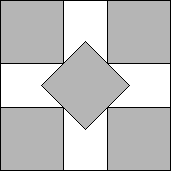
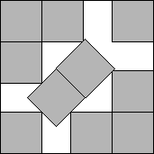
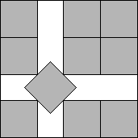
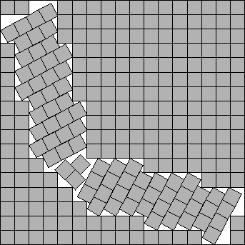

::: tip 问题
把 $n$ 个单位正方形，不重叠地摆放到一个大正方形中，如何摆放可以使得大正方形最小？
:::

<!-- more -->

**示例**：

::: collapse accordion
- 5个单位正方形（已解决）

  
  
  $s(5)=2+1/\sqrt{2}$

  为方便讨论记边长为 $s(n)$

- 10个单位正方形（已解决，有多种方案）

  
  
  
  $s(10)=3+1/\sqrt{2}$

  为方便讨论记边长为 $s(n)$
  
- 272个单位正方形（可能存在更优的方案）

  
  
  $s(272)<17$

  为方便讨论记边长为 $s(n)$

:::

**论文**：

<LinkCard title="正方形内单位正方形的装填" href="https://erich-friedman.github.io/papers/squares/squares.html">
文章梳理了该问题的研究发展历程，给出了当 n≤100 时 s(n) 目前已知的最优上界与下界，并展示了现阶段最优的排布方案。同时，针对 n=2、3、5、8、15、24、35 这些取值，本文给出 s(n) 对应数值的简易证明；针对 n=7 与 n=14，给出更为复杂的推导证明。此外，本文还针对多种取值下的 s(n)，推导证明了其余多项下界结论。
</LinkCard>
