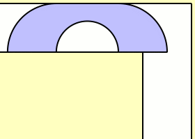
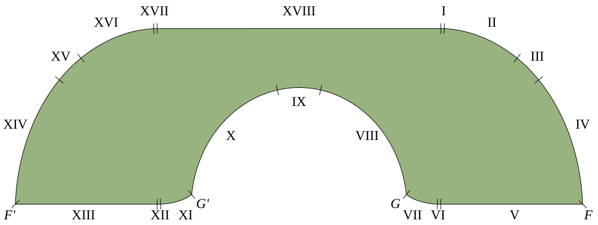

::: tip 问题
在宽度为 $1$ 的直角走廊里，什么样的二维刚体图形可以绕过拐角，并且面积最大？
:::

<!-- more -->

这个问题叫 **移动沙发问题**（Moving Sofa Problem）。它把现实里“沙发能不能搬过转角”的尴尬时刻，理想化成一个平面几何优化问题：走廊是一个宽度为 $1$ 的 L 形区域，沙发则是一个可以平移、旋转但不能变形的平面连通图形。我们要找的是能从走廊一端移动到另一端的最大面积。

这个最大面积通常记为 **移动沙发常数**（moving sofa constant）：

$$
\mu=\sup\{|S|:S\text{ 可以绕过单位宽直角走廊}\}
$$

这里 $|S|$ 表示图形 $S$ 的面积。走廊宽度固定为 $1$ 只是归一化；如果走廊宽度放大为 $w$，面积会按 $w^2$ 放大。

<figure style="text-align: center;">
  
  <figcaption><em>Gerver 沙发绕过单位宽直角过道的示意图。图片源自维基百科。</em></figcaption>
</figure>

## 一、为什么不是矩形

最先想到的“沙发”可能是矩形。若一个长方形宽为 $1$、长为 $a$，想绕过单位宽直角走廊，长边不能太长；经典计算给出的最大矩形面积只有

$$
\sqrt 2\approx 1.4142
$$

但真正的最优形状显然不必是矩形。它可以被削掉一些角，也可以有凹口，让自己在转弯时贴着内外墙滑过去。于是问题从初等几何变成了连续优化：不仅要选择形状，还要同时选择整段搬运路径。

这也是它难的地方。一个候选形状能通过走廊，只说明给出了下界；要证明它最优，还必须排除所有可能更大的形状和所有可能更巧妙的运动方式。

## 二、几个重要下界

早期结果不断把“能搬过去的面积”做大：

| 时间 | 构造者 | 面积 | 说明 |
| --- | --- | --- | --- |
| 1968 | John Hammersley | $\pi/2+2/\pi\approx2.2074$ | “听筒形”沙发，已经明显优于矩形。 |
| 1992 | Joseph L. Gerver | $2.219531\cdots$ | 由 18 段解析曲线和线段组成，长期被猜想为最优。 |

Gerver 的构造通常被称为 **Gerver 沙发**。它看起来像一个被精细削过的老式电话听筒：边界由多段曲线拼接而成，每一段都对应转弯过程中与走廊墙壁发生的某类接触。

它的面积约为 $\mu_G=2.219531\cdots$。

<figure style="text-align: center;">
  
  <figcaption><em>Gerver 沙发形状示意。图片源自 Wikimedia Commons。</em></figcaption>
</figure>

## 三、最优解是什么

目前最强的结论是：**Gerver 沙发就是最优解**，移动沙发常数为

$$
\boxed{\mu=2.219531\cdots}
$$

更准确地说，Jineon Baek 在 2024-11-29 提交预印本 *Optimality of Gerver's Sofa*，证明 Gerver 的 18 段曲线构造达到最大面积。由于这是很新的结果，写作本文时应把它看作“预印本声称已解决，并得到许多正面关注”，而不是已经沉淀多年的教科书定理。

在 Baek 的工作之前，严谨上界和 Gerver 下界之间还有缝隙。比较重要的上界包括：

| 时间 | 作者 | 上界 | 说明 |
| --- | --- | --- | --- |
| 1968 | Hammersley | $2\sqrt2\approx2.8284$ | 早期一般上界。 |
| 2018 | Yoav Kallus、Dan Romik | $2.37$ | 计算机辅助证明，显著缩小缝隙。 |
| 2024 | Jineon Baek | $1+\pi^2/8\approx2.2337$ | 对满足“单射条件”的一大类形状成立，包含 Gerver 沙发。 |
| 2024 | Jineon Baek | $\mu_G$ | 预印本证明 Gerver 沙发全局最优。 |

所以这条线索可以概括为：

$$
2.219531\cdots\leq \mu\leq 2.37
\quad\Longrightarrow\quad
\mu=2.219531\cdots
$$

其中最后一步来自 Baek 2024 年 11 月的预印本。

## 四、什么时候解决的

移动沙发问题通常追溯到 Leo Moser 在 1966 年提出的问题。按这个说法，它大约悬而未决了 58 年。

关键时间线如下：

- **1966 年**：Leo Moser 提出“单位宽走廊里可移动的最大面积区域”问题。
- **1968 年**：Hammersley 给出重要下界 $\pi/2+2/\pi$ 和上界 $2\sqrt2$。
- **1976 年**：Neal R. Wagner 在 *The American Mathematical Monthly* 发表短文 *The Sofa Problem*，帮助这个问题更广泛传播。
- **1992 年**：Joseph L. Gerver 构造面积约为 $2.219531$ 的沙发；这个构造后来成为最优候选。
- **2018 年**：Kallus 与 Romik 发表计算机辅助上界 $\mu\leq2.37$。
- **2024-06**：Baek 的博士论文/预印本给出条件上界 $1+\pi^2/8$。
- **2024-11-29**：Baek 在 arXiv 发布 *Optimality of Gerver's Sofa*，声称并证明 Gerver 沙发最优。
- **2025 年以后**：多篇科普报道把它称为已解决问题，但数学界仍会等待完整同行评议与后续检验。

因此，如果问“什么时候解决的”，最精确的说法是：

> **2024-11-29，Jineon Baek 发布证明 Gerver 沙发最优的 arXiv 预印本；从预印本结论看，移动沙发问题在这一天被解决。**

## 五、相关变体

移动沙发问题还有一些自然变体。最有名的是 **双向沙发问题**（ambidextrous moving sofa problem）：沙发不仅要能向右转，也要能向左转。这个变体的最优构造与原问题不同，常被称为 **Romik 的车**，面积约为

$$
1.644955\cdots
$$

这类变体提醒我们：最优形状不只是“面积尽量大”，还强烈依赖允许的运动方式和走廊几何。

## 六、参考文献

- L. Moser, “Poorly Formulated Unsolved Problems of Combinatorial Geometry”, 1966. 移动沙发问题通常追溯到这份问题集。
- J. M. Hammersley, “On the enfeeblement of mathematical skills by ‘Modern Mathematics’ and by similar soft intellectual trash in schools and universities”, *Bulletin of the Institute of Mathematics and Its Applications*, 1968. 附录中讨论了沙发问题，给出早期上下界。
- Neal R. Wagner, [“The Sofa Problem”](https://doi.org/10.1080/00029890.1976.11994073), *The American Mathematical Monthly*, 83(3), 188-189, 1976.
- Joseph L. Gerver, [“On Moving a Sofa Around a Corner”](https://doi.org/10.1007/BF00147740), *Geometriae Dedicata*, 42, 267-283, 1992.
- Dan Romik, [“Differential Equations and Exact Solutions in the Moving Sofa Problem”](https://doi.org/10.1080/10586458.2016.1270858), *Experimental Mathematics*, 27(3), 316-330, 2018.
- Yoav Kallus, Dan Romik, [“Improved upper bounds in the moving sofa problem”](https://doi.org/10.1016/j.aim.2018.10.022), *Advances in Mathematics*, 340, 960-982, 2018.
- Jineon Baek, [“A Conditional Upper Bound for the Moving Sofa Problem”](https://arxiv.org/abs/2406.10725), arXiv:2406.10725, 2024.
- Jineon Baek, [“Optimality of Gerver's Sofa”](https://arxiv.org/abs/2411.19826), arXiv:2411.19826, 2024.
- Eric W. Weisstein, [“Moving Sofa Constant”](https://mathworld.wolfram.com/MovingSofaConstant.html), MathWorld, Wolfram Research.
- Andy Fell, [“Solving the Moving Sofa Problem”](https://www.ucdavis.edu/blog/solving-moving-sofa-problem), UC Davis, 2024-12-13.
- Jack Murtagh, [“Mathematicians Solve Infamous ‘Moving Sofa Problem’”](https://www.scientificamerican.com/article/mathematicians-solve-infamous-moving-sofa-problem/), *Scientific American*, 2025-02-04.
