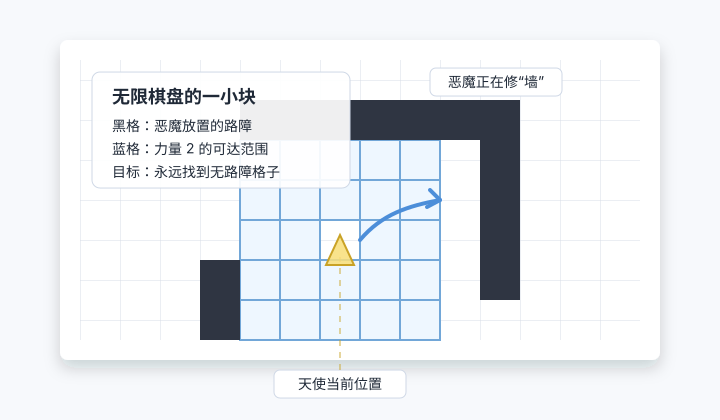

::: tip 问题
在一张无限大的方格棋盘上，恶魔每回合放置一个路障；力量为 $K$ 的天使每回合可以飞到距离不超过 $K$ 的任意无路障格子。是否存在某个有限的 $K$，使天使无论如何都能永远逃下去？
:::

<!-- more -->

::: details 严格规则说明
天使问题是关于一个叫“天使与恶魔”的双人游戏，其规则如下：

1. 两名玩家分别扮演天使和恶魔。
2. 游戏开始前，指定一个正整数 $K$，称之为天使的**力量**。
3. 游戏在一个无限大的方格棋盘上进行；开始时棋盘是空的，天使停留在棋盘上的某一个方格，称为天使的起始点；恶魔并不存在于棋盘上。
4. 每一轮中，恶魔可以在棋盘上放置一个路障，路障不可以放置在天使停留处。
5. 每一轮中，天使可以向相邻格移动至多 $K$ 步，移动过程中可以穿过路障，但移动终点必须停留在没有路障的格中；纵横斜格均算作相邻格。
6. 从恶魔开始，双方交替进行。若从天使开始，也可等价转换为从恶魔开始的局面。
7. 若在一轮中，天使无法移动，则恶魔获胜。
8. 如果天使能够无限地继续游戏，则天使获胜。

天使问题可以陈述为：是否存在某个 $K$，使得力量为 $K$ 的天使拥有必胜策略？
:::

这个问题叫 **天使问题**（Angel Problem），由英国数学家 **约翰·何顿·康威**（John Horton Conway）提出，是一个规则极短、但长期很难处理的组合博弈问题。它也常被称为“天使与恶魔”游戏。

棋盘是所有整数点方格组成的无限棋盘。天使当前在某个格子 $(x,y)$ 上，若它的力量为 $K$，下一步可以飞到任意无路障格子 $(X,Y)$，只要

$$
\max(|X-x|,|Y-y|)\leq K
$$

也就是说，它可以像国际象棋里的王一样向任意方向移动，但一次最多走 $K$ 格；中间经过的格子是否有路障并不重要，因为天使会飞。恶魔获胜的方式，是最终让天使所在位置周围距离不超过 $K$ 的候选落点都被路障占住，使天使再也没有合法落点。天使获胜，则是永远有路可走。

<figure style="text-align: center;">
  
  <figcaption><em>力量为 2 的天使能飞到蓝色范围内的无路障格子；黑色格子是恶魔已经放置的路障。图中只是有限窗口，真实棋盘向四面八方无限延伸。</em></figcaption>
</figure>

## 一、问题为什么不显然

乍看之下，天使似乎很占便宜：恶魔每次只能放置一个路障，而天使力量稍大时，一步就有很多候选落点。比如力量 $2$ 的天使，最多能在以当前位置为中心的 $5\times 5$ 方块内选择落脚。

但恶魔的优势在于**所有路障永久有效**。它不需要立刻包围天使，可以在很远处悄悄修墙、做口袋、布置陷阱；等结构成形后，再用局部的路障把天使逼过去。康威在 1996 年的文章里特别强调，恶魔“不能犯错”这个特性很麻烦：它放过路障的每一个格子，都只会让天使的处境变差，不会帮倒忙。

因此，很多自然策略都会失败。例如“总是向北飞”“总是远离原点”“总是避开附近危险格子”听起来合理，但恶魔可以针对这些单调或局部策略提前设计陷阱。真正的问题不是天使能不能躲过眼前一个路障，而是它能不能有一个全局策略，保证永远不被慢慢围死。

## 二、重要结论

天使问题在 2006 年得到解决。结论非常漂亮：

::: info 定理
力量为 $2$ 的天使有必胜策略；力量为 $1$ 的天使会被恶魔抓住。因此，$K=2$ 是原问题中天使能够保证获胜的最小力量。
:::

按时间线看，关键结果大致如下：

| 时间 | 结果 | 说明 |
| --- | --- | --- |
| 1982 | 问题以“天使与吃方格者”的形式出现在 *Winning Ways* 中 | Berlekamp、Conway、Guy 使这个问题广为人知。 |
| 1996 | Conway 在 *Games of No Chance* 中系统介绍天使问题 | 文章末尾悬赏：天使能赢给 100 美元，恶魔总能赢给 1000 美元。 |
| 早期 | 力量 $1$ 的天使会输 | 力量 $1$ 实际上就是棋盘上的王；恶魔能构造足够厚的围栏。 |
| 2006 | Brian Bowditch 证明力量 $4$ 的天使能赢 | 给出了二维平面上第一个足够强天使可逃脱的证明之一。 |
| 2006 | Oddvar Kloster、András Máthé 分别证明力量 $2$ 的天使能赢 | 这把结论推到最优力量，原问题随之解决。 |
| 2007 | Bowditch、Máthé、Kloster 的论文正式发表 | Bowditch 和 Máthé 发表在 *Combinatorics, Probability and Computing*，Kloster 发表在 *Theoretical Computer Science*。 |

这里最重要的一点是：**解决的是“存在某个有限力量的天使能赢吗”这个原问题，而且更强地说明力量 $2$ 就够了。**

## 三、力量 1 为什么不够

力量 $1$ 的天使每步只能移动到八个相邻格子之一，等价于国际象棋中的王。恶魔虽然每次只能放置一个路障，但可以逐渐修出一条足够厚的屏障，并利用天使速度有限这一点，把天使困在有限区域里。

直观地说，力量 $1$ 的天使太贴地了。它要穿过一条路障线，就必须落在这条线上的某个格子；而这些格子已经不可用。力量 $2$ 的天使则可以直接飞过一格宽的裂缝，这个小小的差别正是临界点。

当然，正式证明并不只是画一堵墙那么简单，因为棋盘无限大，天使也会反向绕路。力量 $1$ 会输的结论说明：这个游戏并不是“天使候选步数多于恶魔每轮一个路障，所以天使必胜”那样的简单计数问题。

## 四、力量 2 为什么能赢

Kloster 的证明给出了一种很有画面感的策略：天使总体上尽量向北走，但如果前方有路障，就允许绕路；只要绕路增加的距离不超过被避开的路障数量的两倍，就接受这次绕行。证明的核心是，恶魔如果想做成一个陷阱，就必须提前投入足够多的路障，而天使能在陷阱真正封口前绕开它。

Máthé 的证明也证明力量 $2$ 的天使能赢，但思路更偏博弈论化：先把恶魔的行动化简成一种“好恶魔”情形，再证明天使在这个化简游戏里能持续前进。Bowditch 的证明则先证明力量 $4$ 的天使能赢，路径和变体游戏的构造非常精巧。

这些证明的共同精神是：天使不能只看眼前哪一步最安全，而要维护某种长期的“逃生通道”。恶魔可以在局部制造麻烦，但若它想用有限速度在无限棋盘上围死一个会飞的力量 $2$ 天使，投入的资源最终跟不上天使维持通道的能力。

## 五、几个容易混淆的点

第一，天使飞行时不受中间格子的影响。它只需要落点没有路障；如果中途跨过一些有路障的格子，并不算违规。

第二，“距离不超过 $K$”通常指切比雪夫距离，也就是横纵坐标差的最大值不超过 $K$。所以力量 $2$ 的天使面对的是一个 $5\times5$ 的候选方块，而不是欧氏圆盘。

第三，恶魔每回合可以在棋盘上任意一个非天使所在格放置路障，不需要靠近天使。这正是问题困难的来源：恶魔能在远方预先施工，天使必须对尚未显形的陷阱保持余地。

第四，2006 年解决的是二维无限方格棋盘上的原问题。它仍然有许多变体，例如高维版本、限制天使运动方向的版本、多个恶魔或不同路障规则的版本；这些变体的状态不能简单照搬原定理。

## 六、小结

天使问题可以记成一句话：

> 恶魔每次只能放置一个路障；力量为 $2$ 的天使已经足够聪明，可以在无限棋盘上永远逃下去。

它迷人的地方在于临界非常锋利：力量 $1$ 输，力量 $2$ 赢。康威把这个问题包装成一个近乎童话的追逐游戏，但答案背后是严肃的组合博弈、平面格路径和无穷策略分析。

## 参考资料

- John H. Conway, [“The Angel Problem”](https://library.slmath.org/books/Book29/files/conway.pdf), in *Games of No Chance*, MSRI Publications 29, 1996, pp. 3-12.
- Elwyn R. Berlekamp, John H. Conway, Richard K. Guy, *Winning Ways for Your Mathematical Plays*, Vol. 2, Academic Press, 1982. 天使问题早期以 “the angel and the square-eater” 形式传播。
- Brian H. Bowditch, [“The Angel Game in the Plane”](https://doi.org/10.1017/S0963548306008297), *Combinatorics, Probability and Computing*, 16(3), 345-362, 2007.
- András Máthé, [“The Angel of Power 2 Wins”](https://doi.org/10.1017/S0963548306008303), *Combinatorics, Probability and Computing*, 16(3), 363-374, 2007.
- Oddvar Kloster, [“A solution to the Angel Problem”](https://doi.org/10.1016/j.tcs.2007.08.006), *Theoretical Computer Science*, 389(1-2), 152-161, 2007.
- Peter Gács, [“The Angel Wins”](https://www.cs.bu.edu/faculty/gacs/papers/angel.pdf), manuscript, 2006/2007.
- Martin Kutz, [*The Angel Problem, Positional Games, and Digraph Roots*](https://refubium.fu-berlin.de/handle/fub188/8288), PhD thesis, Freie Universität Berlin, 2004.
- Eric W. Weisstein, [“Angel Problem”](https://mathworld.wolfram.com/AngelProblem.html), MathWorld, Wolfram Research.
- Oddvar Kloster, [Angel Problem site](https://web.archive.org/web/20080702081929/http://home.broadpark.no/~oddvark/angel/index.html), archived copy.
